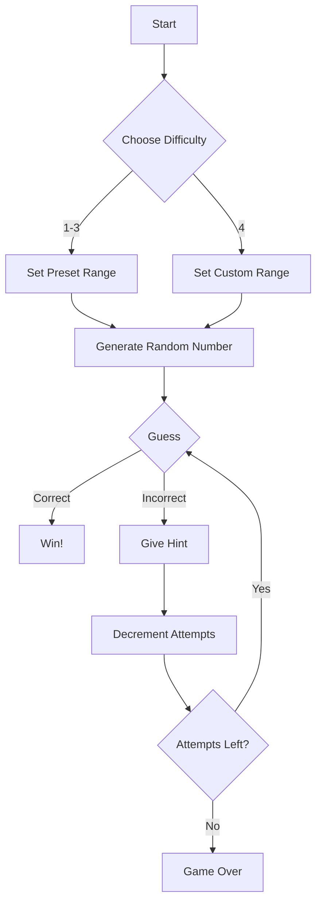

# 🔢 Number Guessing Game

A colorful, terminal-based number guessing game with multiple difficulty levels and smart hints!

[](https://python.org)
[](LICENSE)

 *Replace with actual screenshot/gif*

## ✨ Features
- **Multi-colored UI** (using `colorama`)
- **4 Difficulty Modes**:
  - 🟩 `Beginner`: 1-50 (10 attempts)
  - 🟨 `Intermediate`: 1-100 (7 attempts)
  - 🟥 `Expert`: 1-500 (5 attempts)
  - 🟦 `Custom`: Set your own range
- **Smart Feedback**:
  - 🔥 **Warm/Cold** hints (color-coded)
  - 📈 **Attempt counter** that changes color when low
- **Play Again** option without restarting
- **Fun Reactions** based on performance:
  - 🤯 Legendary (1st try)
  - 😎 Impressive (≤3 tries)
  - 😅 Close one (last attempt)

## 🛠️ Installation
```bash
# 1. Install Python 3.6+ if needed
# 2. Install colorama:
pip install colorama

# 3. Download the game:
curl -O https://raw.githubusercontent.com/yourusername/number-guesser/main/guess_the_number.py
```
## 🎮 How to Play
```bash
python guess_the_number.py
```
1. Select difficulty (1-4)
2. Guess numbers based on:
   - 🟥 Red = Too high
   - 🟦 Blue = Too low
   - 🔥/❄️ Warmth indicators
3. With within given attempts!

## 🎨 Customization
Edit these values in the code:
```python
# Change difficulty presets:
DIFFICULTY = {
    '1': {'name': 'Starter', 'range': (1, 30)},  # ← Modify here
    # ...
}

# Change colors (Fore.RED, Fore.GREEN, etc.)
print(f"{Fore.MAGENTA}New colorful message!")
```

## 📜 Game Logic



## 🤝 Contributing
Personal recommendations welcome for:
- New dificulty levels
- Additional color themes
- Sound effects
- Score tracking system

